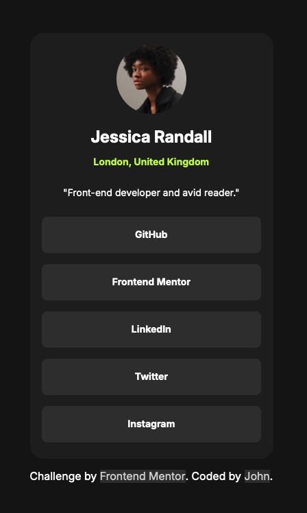

# Frontend Mentor - Social links profile solution

This is a solution to the [Social links profile challenge on Frontend Mentor](https://www.frontendmentor.io/challenges/social-links-profile-UG32l9m6dQ). Frontend Mentor challenges help you improve your coding skills by building realistic projects. 

## Table of contents

- [Overview](#overview)
  - [The challenge](#the-challenge)
  - [Screenshot](#screenshot)
  - [Links](#links)
- [My process](#my-process)
  - [Built with](#built-with)
  - [What I learned](#what-i-learned)
  - [Continued development](#continued-development)
  - [Useful resources](#useful-resources)
  - [AI Collaboration](#ai-collaboration)
- [Author](#author)

**Note: Delete this note and update the table of contents based on what sections you keep.**

## Overview

### The challenge

Users should be able to:

- See hover and focus states for all interactive elements on the page

### Screenshot



### Links

- Solution URL: [Solution URL here](https://github.com/RoomForEpsilon/social-links-profile)
- Live Site URL: [Live site URL here](https://roomforepsilon.github.io/social-links-profile/)

## My process

The last project I worked through I used git more extensively because I got a poor score on the project previously.  I felt it that documenting my process was more effort than it was worth, and I feel the same with this project.  It's really just build the page, clean up the code, fix mistakes, and done.  For more complex projects, I think planning it out more and following that planning with git commits would be beneficial.  

### Built with

- Semantic HTML5 markup
- CSS custom properties
- Flexbox

### What I learned

I focused on flexbox for this project.  I feel like I still have things to learn when using flexbox, but I was able to finish this project.  One of my biggest weaknesses is the fear of missing out when it comes to the best way to learn css.  When I struggle a little bit with using flexbox, my mind easily falls into the state of, "I'm not good enough.  I didn't learn flex.  I need to use a different resource to learn it right this time."  While there is value in studying different resources, I learned a lot by reading through Web.dev, but I felt the time I spent wasn't worth just working on this project.  The best thing for me would be to work on projects and look up things I don't know as I go, and in the future tutor other people to get another perspective on learning css from a different source.  I should believe in myself a little more, but it's easy for me to doubt myself. 

One think I did that I was happy I did was I took the text preset styles from the figma design file, made them classes, and added the specific class to the element I wanted the text to be styled a certain way.  This might seem obvious to do if you have access, but I didn't have a pro account before this project.  Even so, now I think I'm going to think about how components are styled, and which styles are used over and over again (like the font style).  I think doing things this way will help make the code easier to read.  It's a step in the right direction for me.  Here's a code snippet of what I'm talking about.

```html
  <h1 class="name textPreset1">Jessica Randall</h1>
```
```css
.textPreset1 {
    font-family: Inter, sans-serif;
    font-weight: bold;
    font-size: 1.5rem;
    line-height: 1.5;
}
```

One final thing for those who don't have pro accounts.  I don't think its necessary to have a pro account to get the most out of FrontEndMentor while working on the introductory module.  In fact, I think it might be better to not have it, because I've heard it argued that making a page a pixel-perfect match isn't as beneficial as making it pass the eyeball test.  Here's a link for those interested https://www.joshwcomeau.com/css/pixel-perfection/ .  I think working from the preview image, not from the figma design file, builds that type of skill.  The reason why I went to the figma design file is I felt text in one part was gray, but ChatGPT insisted it was white.  As one progresses through FrontEndMentor, I suspect it would be beneficial to know how to use figma design files, so it would be beneficial to pay for pro then, but it's not a necessity.  

### Continued development

As I said earlier, I'm going to continue to define classes for text styling and assign the different elements to the classes who's style I want them having.  I'm also going to think about how I can use that for other design decisions.

### Useful resources

- [Chasing the Pixel-Perfect Dream](https://www.joshwcomeau.com/css/pixel-perfection/) -- I already posted the link, but I thought it might be helpful to put it here too.
- [YouTube video about transitions](https://www.youtube.com/watch?v=Nloq6uzF8RQ) - This video helped me understand transitions so I could implement the hover states.`

### AI Collaboration

I used ChatGPT to help me review the code that I wrote.  I wouldn't have caught some unused styles without it.  I also talked with it about conceptual questions.

## Author

- Frontend Mentor - [@yourusername](https://www.frontendmentor.io/profile/RoomForEpsilon)

